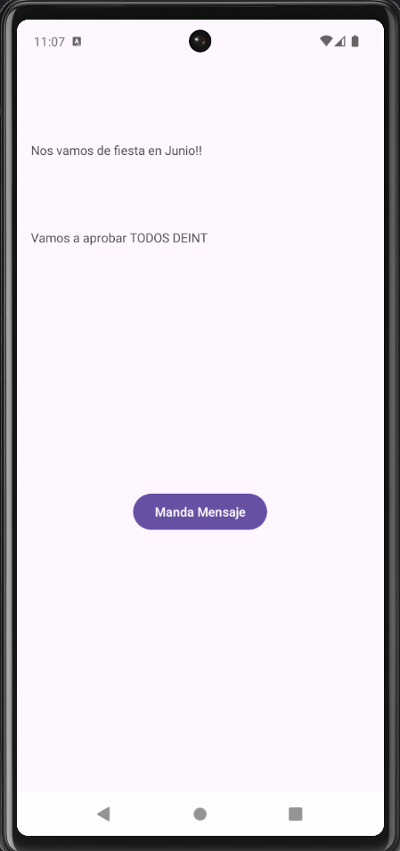

# Hello World App

## Contenidos Aprendidos

En este proyecto, se han cubierto los siguientes conceptos clave del desarrollo en Android:

1. **Añadir dependencias al proyecto**: Se aprendió a gestionar las dependencias necesarias en el archivo `build.gradle` para incorporar bibliotecas externas y funcionalidades adicionales en el proyecto.

2. **Crear un layout en XML**: Se diseñó una interfaz de usuario en XML que incluye dos elementos de texto y un botón. Se trabajó con las vistas ([TextView](https://developer.android.com/reference/android/widget/TextView?hl=en) y [Button](https://developer.android.com/reference/android/widget/Button?hl=en)) y se estructuró el layout utilizando diferentes atributos y restricciones para garantizar una interfaz amigable para el usuario.

3. **Sincronizar el proyecto con Firebase**: Se integró Firebase al proyecto para habilitar diferentes servicios como Analytics, Firestore, o autenticación de usuarios. Incluye la configuración de dependencias y la sincronización del proyecto con Firebase.

4. **Crear una excepción con `throws`**: Se abordó el manejo de excepciones mediante el uso de `throws`. Este enfoque se utilizó para indicar que un método específico podría lanzar una excepción, mejorando la gestión de errores en la aplicación.

5. **Utilizar el registro de sucesos LogCat**: Se utilizó `LogCat` para registrar sucesos durante la ejecución de la aplicación, ayudando en el proceso de depuración y monitoreo del comportamiento de la aplicación. Se aprendió a utilizar los niveles de log como [Log.d](https://developer.android.com/reference/android/util/Log?hl=en#d(java.lang.String,%20java.lang.String)), [Log.e](https://developer.android.com/reference/android/util/Log?hl=en#e(java.lang.String,%20java.lang.String)), [Log.i](https://developer.android.com/reference/android/util/Log?hl=en#i(java.lang.String,%20java.lang.String)), entre otros, para proporcionar diferentes tipos de información.

6. **Generar la documentación en formato HTML**: Se generó documentación del código utilizando [Dokka](https://kotlinlang.org/docs/dokka-get-started.html), la herramienta de documentación para Kotlin. La documentación se encuentra en la carpeta `docs/` y contiene enlaces internos, enlaces externos a [Android Developers](https://developer.android.com) y utiliza formato Markdown.

7. **Inicialización tardía (`lateinit`) y perezosa (`by lazy`)**: Se estudió el uso de `lateinit` y `by lazy` en Kotlin. `lateinit` permite inicializar propiedades no nulas después de la declaración, mientras que `by lazy` permite la inicialización perezosa de una propiedad solo cuando se utiliza por primera vez, optimizando así el uso de recursos.


## Instalación y configuración
Para ejecutar este proyecto, necesitarás:

1. Android Studio.
2. Clonar este repositorio en tu máquina local usando `git clone URL_DEL_REPOSITORIO`.
3. Abrir el proyecto en Android Studio.

## Ejecución
Para ejecutar la aplicación en un emulador o dispositivo físico:

1. Abre el proyecto en Android Studio.
2. Ejecuta el proyecto usando 'Run > Run 'app''.
3. La aplicación debería iniciar en el dispositivo o emulador seleccionado mostrando los mensajes configurados.

## Estructura del proyecto
El proyecto contiene las siguientes partes clave:

- `MainActivity.kt`: Clase que extiende `AppCompatActivity` y configura los mensajes de `TextView`.
- `activity_main.xml`: Archivo XML que define la UI de la aplicación.
- `colors.xml` y `strings.xml`: Archivos de recursos que definen los colores y cadenas utilizadas en la aplicación.
- `docs/`: Documentación generada por Dokka en formato HTML.

## Documentación
La documentación del proyecto se ha generado con [Dokka](https://kotlinlang.org/docs/dokka-get-started.html) y está disponible en `docs/`. Para regenerar la documentación:

```bash
./gradlew dokkaHtml
```

La documentación incluye:
- Etiquetas HTML para estructura
- Enlaces internos entre clases y métodos
- Enlaces externos a [Android Developers](https://developer.android.com)
- Formato Markdown para estilos

## GitHub Actions

El proyecto incluye dos workflows automatizados:

### Despliegue a GitHub Pages
- **Archivo:** `.github/workflows/deploy-docs.yml`
- **Trigger:** Push a `main`
- **Función:** Despliega la documentación Dokka a GitHub Pages
- **URL:** https://moronlu18.github.io/HelloWorldKotlin/

### Sincronización con Wiki
- **Archivo:** `.github/workflows/sync-wiki.yml`
- **Trigger:** Cambios en `README.md`
- **Función:** Sincroniza el README con la Wiki de GitHub
- **Genera:**
  - `Home.md` desde el README
  - `_Sidebar.md` con los headings (H1, H2, H3)
  - Copia imágenes de `img/`

### Configuración Requerida

1. **GitHub Pages:** Settings → Pages → Source: "Deploy from a branch" → main → /docs
2. **Wiki:** Settings → General → Features → Marcar Wikis
3. **Token:** Crear PAT con permiso `repo` y guardar como secreto `WIKI_TOKEN`

Para más detalles, consulta [WIKI-SETUP-GUIDE.md](WIKI-SETUP-GUIDE.md).

## Imagen de la Aplicación



## Autora
 Lourdes Rodríguez Morón :tada:

## Versión
1.0

## Licencia
Este proyecto está licenciado bajo la [Licencia MIT](https://opensource.org/licenses/MIT). Consulta el archivo `LICENSE` para más detalles.
le.kts" beforeDir="false" afterPath="$PROJECT_DIR$/settings.gradle.kts" afterDir="false" />
    </list>
    <option name="SHOW_DIALOG" value="false" />
    <option name="HIGHLIGHT_CONFLICTS" value="true" />
    <option name="HIGHLIGHT_NON_ACTIVE_CHANGELIST" value="false" />
    <option name="LAST_RESOLUTION" value="IGNORE" />
  </component>
  <component name="ClangdSettings">
    <option name="formatViaClangd" value="false" />
  </component>
  <component name="ExecutionTargetManager" SELECTED_TARGET="device_and_snapshot_combo_box_target[]" />
  <component name="ExternalProjectsData">
    <projectState path="$PROJECT_DIR$">
      <ProjectState />
    </projectState>
  </component>
  <component name="ExternalProjectsManager">
    <system id="GRADLE">
      <state>
        <task path="$PROJECT_DIR$/app">
          <activation />
        </task>
        <task path="$PROJECT_DIR$">
          <activation />
        </task>
        <projects_view>
          <tree_state>
            <expand>
              <path>
                <item name="" type="6a2764b6:ExternalProjectsStructure$RootNode" />
                <item name="HelloWorld" type="f1a62948:ProjectNode" />
              </path>
            </expand>
            <select />
          </tree_state>
        </projects_view>
      </state>
    </system>
  </component>
  <component name="Git.Settings">
    <excluded-from-favorite>
      <branch-storage>
        <map>
          <entry type="LOCAL">
            <value>
              <list>
                <branch-info repo="$PROJECT_DIR$" source="master" />
              </list>
            </value>
          </entry>
        </map>
      </branch-storage>
    </excluded-from-favorite>
    <option name="PUSH_AUTO_UPDATE" value="true" />
    <option name="PUSH_TAGS">
      <GitPushTagMode>
        <option name="argument" value="--tags" />
        <option name="title" value="All" />
      </GitPushTagMode>
    </option>
    <option name="RECENT_GIT_ROOT_PATH" value="$PROJECT_DIR$" />
  </component>
  <component name="MarkdownSettingsMigration">
    <option name="stateVersion" value="1" />
  </component>
  <component name="ProblemsViewState">
    <option name="selectedTabId" value="CurrentFile" />
  </component>
  <component name="ProjectColorInfo">{
  &quot;associatedIndex&quot;: 8
}</component>
  <component name="ProjectId" id="2VhMX0FOjJnc6C529My0RcJ5jjN" />
  <component name="ProjectViewState">
    <option name="hideEmptyMiddlePackages" value="true" />
    <option name="showLibraryContents" value="true" />
  </component>
  <component name="PropertiesComponent"><![CDATA[{
  "keyToString": {
    "Android App.app.executor": "Run",
    "Gradle.HelloWorld [dokka].executor": "Run",
    "Gradle.Load Gradle Dependencies.executor": "Run",
    "RunOnceActivity.OpenProjectViewOnStart": "true",
    "RunOnceActivity.ShowReadmeOnStart": "true",
    "RunOnceActivity.cidr.known.project.marker": "true",
    "RunOnceActivity.git.unshallow": "true",
    "RunOnceActivity.readMode.enableVisualFormatting": "true",
    "android.gradle.sync.needed": "true",
    "cf.first.check.clang-format": "false",
    "cidr.known.project.marker": "true",
    "dart.analysis.tool.window.visible": "false",
    "device.streaming.spark.single.device.do.not.ask": "true",
    "file.manager.left.side.uri": "file:///home/lourdes/",
    "file.manager.right.side.uri": "file:///home/lourdes/",
    "git-widget-placeholder": "main",
    "kotlin-language-version-configured": "true",
    "last_opened_file_path": "/home/lourdes/pCloudDrive/Clases/JETPACK/1. Introduccion Android/ejercicios_clase/HelloWorldKotlinViewBinding",
    "project.structure.last.edited": "Dependencies",
    "project.structure.proportion": "0.17",
    "project.structure.side.proportion": "0.2",
    "settings.editor.selected.configurable": "build.tools"
  }
}]]></component>
  <component name="PsdUISettings">
    <option name="LAST_EDITED_BUILD_TYPE" value="release" />
  </component>
  <component name="RecentsManager">
    <key name="CopyFile.RECENT_KEYS">
      <recent name="$PROJECT_DIR$/app/src/main/res/drawable" />
    </key>
    <key name="MoveFile.RECENT_KEYS">
      <recent name="$PROJECT_DIR$/app/src/main/res" />
    </key>
  </component>
  <component name="RunAnythingCache">
    <option name="myCommands">
      <command value="gradle dokka" />
    </option>
  </component>
  <component name="RunManager">
    <configuration name="app" type="AndroidRunConfigurationType" factoryName="Android App">
      <module name="HelloWorld.app" />
      <option name="ANDROID_RUN_CONFIGURATION_SCHEMA_VERSION" value="1" />
      <option name="DEPLOY" value="true" />
      <option name="DEPLOY_APK_FROM_BUNDLE" value="false" />
      <option name="DEPLOY_AS_INSTANT" value="false" />
      <option name="ARTIFACT_NAME" value="" />
      <option name="PM_INSTALL_OPTIONS" value="" />
      <option name="ALL_USERS" value="false" />
      <option name="ALWAYS_INSTALL_WITH_PM" value="false" />
      <option name="ALLOW_ASSUME_VERIFIED" value="false" />
      <option name="CLEAR_APP_STORAGE" value="false" />
      <option name="DYNAMIC_FEATURES_DISABLED_LIST" value="" />
      <option name="ACTIVITY_EXTRA_FLAGS" value="" />
      <option name="MODE" value="default_activity" />
      <option name="RESTORE_ENABLED" value="false" />
      <option name="RESTORE_FILE" value="" />
      <option name="RESTORE_FRESH_INSTALL_ONLY" value="false" />
      <option name="CLEAR_LOGCAT" value="false" />
      <option name="SHOW_LOGCAT_AUTOMATICALLY" value="false" />
      <option name="TARGET_SELECTION_MODE" value="DEVICE_AND_SNAPSHOT_COMBO_BOX" />
      <option name="DEBUGGER_TYPE" value="Auto" />
      <Auto>
        <option name="USE_JAVA_AWARE_DEBUGGER" value="false" />
        <option name="SHOW_STATIC_VARS" value="true" />
        <option name="WORKING_DIR" value="" />
        <option name="TARGET_LOGGING_CHANNELS" value="lldb process:gdb-remote packets" />
        <option name="SHOW_OPTIMIZED_WARNING" value="true" />
        <option name="ATTACH_ON_WAIT_FOR_DEBUGGER" value="false" />
      </Auto>
      <Hybrid>
        <option name="USE_JAVA_AWARE_DEBUGGER" value="false" />
        <option name="SHOW_STATIC_VARS" value="true" />
        <option name="WORKING_DIR" value="" />
        <option name="TARGET_LOGGING_CHANNELS" value="lldb process:gdb-remote packets" />
        <option name="SHOW_OPTIMIZED_WARNING" value="true" />
        <option name="ATTACH_ON_WAIT_FOR_DEBUGGER" value="false" />
      </Hybrid>
      <Java>
        <option name="ATTACH_ON_WAIT_FOR_DEBUGGER" value="false" />
      </Java>
      <Native>
        <option name="USE_JAVA_AWARE_DEBUGGER" value="false" />
        <option name="SHOW_STATIC_VARS" value="true" />
        <option name="WORKING_DIR" value="" />
        <option name="TARGET_LOGGING_CHANNELS" value="lldb process:gdb-remote packets" />
        <option name="SHOW_OPTIMIZED_WARNING" value="true" />
        <option name="ATTACH_ON_WAIT_FOR_DEBUGGER" value="false" />
      </Native>
      <Profilers>
        <option name="ADVANCED_PROFILING_ENABLED" value="false" />
        <option name="STARTUP_PROFILING_ENABLED" value="false" />
        <option name="STARTUP_CPU_PROFILING_ENABLED" value="false" />
        <option name="STARTUP_CPU_PROFILING_CONFIGURATION_NAME" value="Java/Kotlin Method Sample (legacy)" />
        <option name="STARTUP_NATIVE_MEMORY_PROFILING_ENABLED" value="false" />
        <option name="NATIVE_MEMORY_SAMPLE_RATE_BYTES" value="2048" />
      </Profilers>
      <option name="DEEP_LINK" value="" />
      <option name="ACTIVITY" value="" />
      <option name="ACTIVITY_CLASS" value="" />
      <option name="SEARCH_ACTIVITY_IN_GLOBAL_SCOPE" value="false" />
      <option name="SKIP_ACTIVITY_VALIDATION" value="false" />
      <method v="2">
        <option name="Android.Gradle.BeforeRunTask" enabled="true" />
      </method>
    </configuration>
  </component>
  <component name="SpellCheckerSettings" RuntimeDictionaries="0" Folders="1" Folder0="$USER_HOME$/Android/diccionario IDE" CustomDictionaries="1" CustomDictionary0="$USER_HOME$/Android/diccionario IDE/es.dic" DefaultDictionary="application-level" UseSingleDictionary="true" transferred="true" />
  <component name="TaskManager">
    <task active="true" id="Default" summary="Default task">
      <changelist id="bed6c5b2-a500-44c1-b8ad-f48b023d28b3" name="Changes" comment="" />
      <created>1695283895572</created>
      <option name="number" value="Default" />
      <option name="presentableId" value="Default" />
      <updated>1695283895572</updated>
    </task>
    <servers />
  </component>
  <component name="Vcs.Log.Tabs.Properties">
    <option name="OPEN_GENERIC_TABS">
      <map>
        <entry key="95cc8d65-e8bd-40a0-985c-512d6777ba58" value="TOOL_WINDOW" />
        <entry key="a76206d4-91ce-4875-a40b-da0d6eb58da3" value="TOOL_WINDOW" />
      </map>
    </option>
    <option name="RECENT_FILTERS">
      <map>
        <entry key="Branch">
          <value>
            <list>
              <RecentGroup>
                <option name="FILTER_VALUES">
                  <option value="HEAD" />
                </option>
              </RecentGroup>
              <RecentGroup>
                <option name="FILTER_VALUES">
                  <option value="origin/master" />
                </option>
              </RecentGroup>
            </list>
          </value>
        </entry>
      </map>
    </option>
    <option name="TAB_STATES">
      <map>
        <entry key="95cc8d65-e8bd-40a0-985c-512d6777ba58">
          <value>
            <State>
              <option name="CUSTOM_BOOLEAN_PROPERTIES">
                <map>
                  <entry key="Show.Git.Branches" value="true" />
                </map>
              </option>
              <option name="FILTERS">
                <map>
                  <entry key="branch">
                    <value>
                      <list>
                        <option value="HEAD" />
                      </list>
                    </value>
                  </entry>
                </map>
              </option>
            </State>
          </value>
        </entry>
        <entry key="MAIN">
          <value>
            <State>
              <option name="FILTERS">
                <map>
                  <entry key="branch">
                    <value>
                      <list>
                        <option value="main" />
                      </list>
                    </value>
                  </entry>
                </map>
              </option>
            </State>
          </value>
        </entry>
        <entry key="a76206d4-91ce-4875-a40b-da0d6eb58da3">
          <value>
            <State>
              <option name="FILTERS">
                <map>
                  <entry key="branch">
                    <value>
                      <list>
                        <option value="HEAD" />
                      </list>
                    </value>
                  </entry>
                </map>
              </option>
            </State>
          </value>
        </entry>
      </map>
    </option>
  </component>
</project>